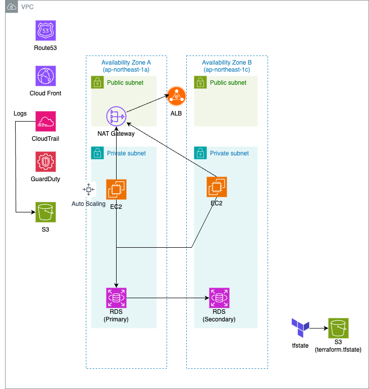
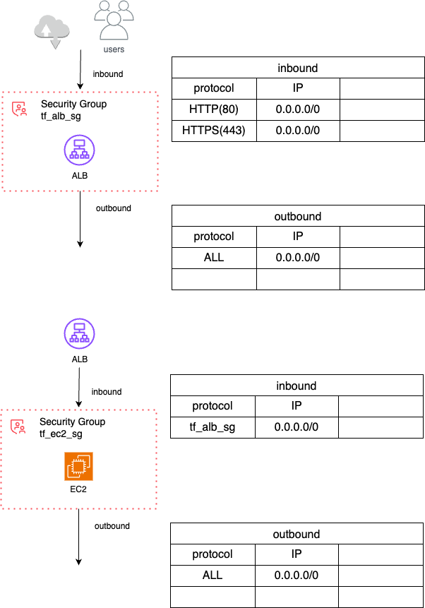

# TerraformでのAWS構築
- tfstateをS3に保存しています。
- 初回にterraform apply  -var="bucket_name=terraform-backend-{好きな名前で}" -var="dynamodb_table=terraform-locks"

## ソース構造
```
portfolio-aws/
├── backend/                    プロバイダ情報とtfstateをS3に保存するための箇所
│   ├── main.tf
│   ├── outputs.tf
│   ├── provider.tf
│   └── variables.tf
├── envs/                       環境ごとにメインソースへの引き渡しのために記載
│   └── dev/                    開発環境のリソース
│       ├── backend.tf
│       ├── cloudgtrail.tf
│       ├── guardduty.tf
│       ├── main.tf
│       ├── provider.tf
│       ├── variables.tf
│       └── version.tf
├── modules/                    メイン実行箇所（サービスごとにモジュール化）
│   ├── iam/                    IAM
│   │   ├── main.tf
│   │   ├── variables.tf
│   │   └── outputs.tf
│   ├── lambda_nat_schedule/    Lambda(NAT Gatewayスケジュール稼働用)
│   │   ├── index.js            Lambda関数本体(Node.js ver.20)
│   │   ├── main.tf             Lambda関数定義
│   │   ├── utils.js            Node.jsの副関数
│   │   ├── variables.tf
│   │   └── outputs.tf
│   └── vpc/                    VPC ・・・現状他全サービスを記載、後ほどモジュール化する
│       ├── main.tf
│       ├── variables.tf
│       └── outputs.tf
├── architecture.drawio         Draw.io on VSCode
├── architecture.png            上記をPNGでエクスポートしたもの
└── README.md                   当ファイル
```

## 構成図（draw.io）



### 構築対象
- すべて東京リージョンに作成
- VPC
    - CIDR:10.1.0.0/16
- Subnet（Public2つ、Private2つ、マルチAZ）
    - Public Subnet 1A:10.1.1.0/24
    - Public Subnet 1C:10.1.2.0/24
    - Private Subnet 1A:10.1.11.0/24
    - Private Subnet 1C:10.1.12.0/24
- Internet Gateway
- Elastic IP (NAT Gateway用)
    - 割当済みしているだけで料金かかる
    - NAT Gatewayの作成削除の自動化（下記）に合わせてEIPも再作成、開放する
- NAT Gateway
    - 単一AZ(1a)にのみ配置、共用
    - 常時稼働だとそこそこな金額がかかるので、平日の日中帯（月〜金、9:00〜18:00）だけ稼働させる
    - EventBridgeで自動化

### 未着手
- ALB
- EC2
- Auto Scaling Group(ASG)
[Launch Template]
        ↓
[Target Group] ←────────────── [Application Load Balancer]
        ↓                                  ↓
[Auto Scaling Group] ─────────> [Listener (HTTP/HTTPS)]

- RDS(単一AZ)

### セキュリティ対策
- CloudTrail
- GuardDuty

## 金額（Princing Calculater）
[Pricing Caliculater](https://calculator.aws/#/estimate?id=9d9291af33bccce67cbdd8431ba98dcb4ccf52d7)

## Node.js ver.18からAWS SDKを同梱する必要があります
- 当ディレクトリでnpm install aws-sdkして、lambda.zipにnode_modulesを含めること

## lambda.zipの作り方
- zip -r lambda.zip index.js utils.js node_modules/ package.json

## Lambda関数(NAT Gatewayスケジュール起動)の手動実行
- aws lambda invoke --function-name nat-gateway-scheduler --payload '{"action":"start"}' --cli-binary-format raw-in-base64-out --cli-read-timeout 300 result.json
