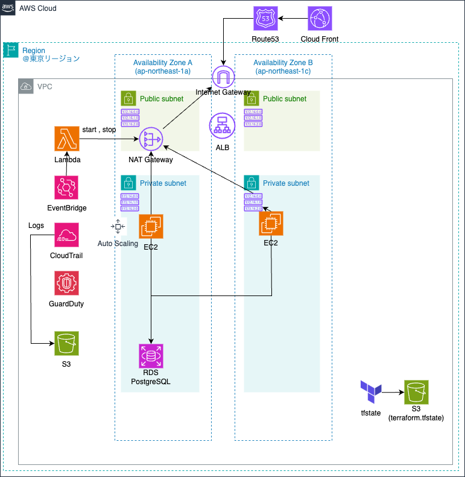

# TerraformでのAWS構築
- tfstateをS3に保存しています。
- 初回にterraform apply  -var="bucket_name=terraform-backend-{好きな名前で}" -var="dynamodb_table=terraform-locks"

## 構成図（draw.io）

### 構築対象
- すべて東京リージョンに作成
- VPC
    - CIDR:10.1.0.0/16
- Subnet（Public2つ、Private2つ、マルチAZ）
    - Public Subnet 1A:10.1.1.0/24
    - Public Subnet 1C:10.1.2.0/24
    - Private Subnet 1A:10.1.11.0/24
    - Private Subnet 1C:10.1.12.0/24
- Internet Gateway
- Elastic IP (NAT Gateway用)
- NAT Gateway
### 未着手
- ALB
- EC2
- RDS（マルチAZ）

### セキュリティ対策
- CloudTrail
- GuardDuty
